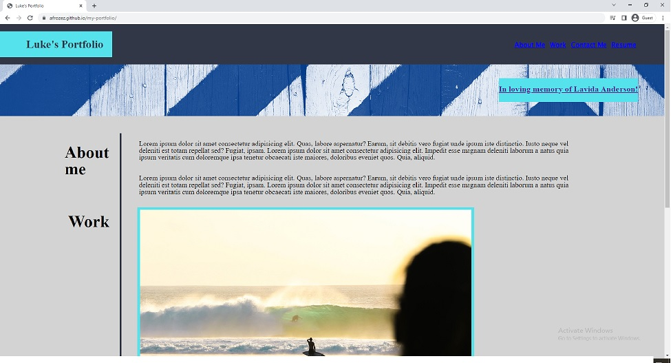

# my-portfolio

# My Portfolio

<a href="https://afrozez.github.io/my-portfolio/"> Link to my site: afrozez.github.io/my-portfolio/</a>

## This portfolio provided some experience creating a web page from scratch. It displays a number of different HTML and CSS elements styled in a nice presentable manner.

   
    This (https://afrozez.github.io/my-portfolio/) project displays information about myself, presents links that will direct you to my work/projects made in the future. There is numerous ways to get into contact with the creator of the portfolio on the bottom of the page.

What are the steps required to install your project? Provide a step-by-step description of how to get the development environment running: N/A

## Usage
    This (https://afrozez.github.io/my-portoflio/) module-02 can later be looked at and edited to showcase my proficiency creating a web page. This portfolio will also be added to a github to display my experience to futue visitors to my github page.

    If any users have any questions about how to start the project they may send questions to LukeADenHartog@gmail.com.

## Credits
N/A

## License
N/A

Copyright (c) 2023 Luke

Permission is hereby granted, free of charge, to any person obtaining a copy
of this software and associated documentation files (the "Software"), to deal
in the Software without restriction, including without limitation the rights
to use, copy, modify, merge, publish, distribute, sublicense, and/or sell
copies of the Software, and to permit persons to whom the Software is
furnished to do so, subject to the following conditions:

The above copyright notice and this permission notice shall be included in all
copies or substantial portions of the Software.

THE SOFTWARE IS PROVIDED "AS IS", WITHOUT WARRANTY OF ANY KIND, EXPRESS OR
IMPLIED, INCLUDING BUT NOT LIMITED TO THE WARRANTIES OF MERCHANTABILITY,
FITNESS FOR A PARTICULAR PURPOSE AND NONINFRINGEMENT. IN NO EVENT SHALL THE
AUTHORS OR COPYRIGHT HOLDERS BE LIABLE FOR ANY CLAIM, DAMAGES OR OTHER
LIABILITY, WHETHER IN AN ACTION OF CONTRACT, TORT OR OTHERWISE, ARISING FROM,
OUT OF OR IN CONNECTION WITH THE SOFTWARE OR THE USE OR OTHER DEALINGS IN THE
SOFTWARE.